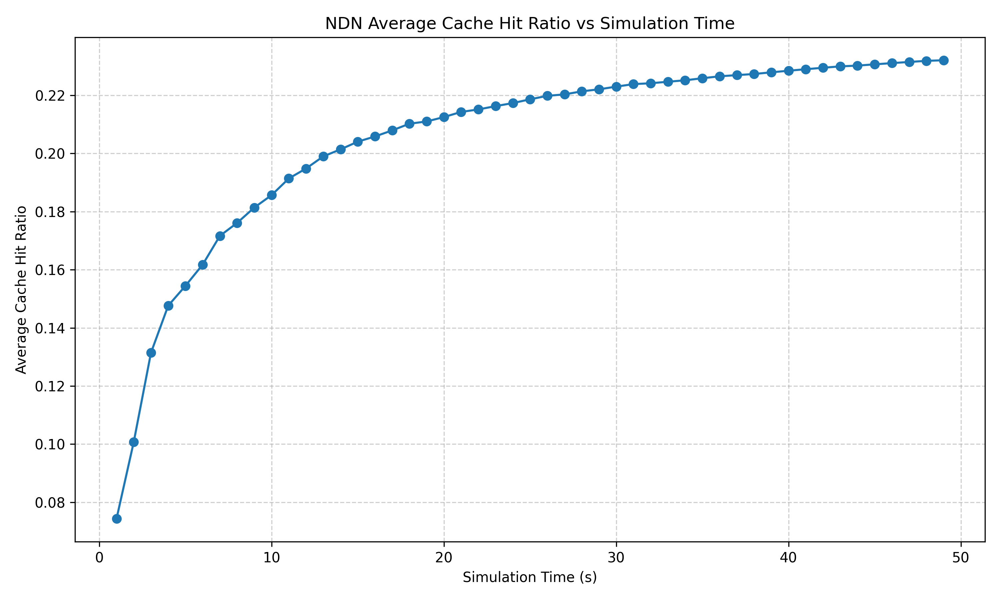

# ndnSIM Custom Content Store Tracer

Caching is a core characteristic of Named Data Networking (NDN) and is heavily used in ndnSIM simulations. Traditionally, ndnSIM provides a built-in mechanism, `:ndnsim:ndn::CsTracer`, which records cache hits and misses for each node. However, starting from ndnSIM 2.8 and later, the internal NFD packet processing pipeline was updated, and the legacy `CsTracer` no longer reflects actual Content Store behavior correctly.

You can use this custom tracer to track cache hits and misses accurately. By inspecting the NFD source code, specifically `forwarder.hpp`, we see that NFD exposes public cumulative counters (`nCsHits`, `nCsMisses`) through `getForwarder()->getCounters()`. These internal counters remain correct regardless of tracer changes, making them reliable for logging CS activity.



## **Usage**

### **Installation**

1. Install ndnSIM: https://ndnsim.net/current/
2. Clone this repository into your `ns-3/scratch` directory.

## **Compilation**

Run the simulation:

```bash
./waf --run custom-cs-tracer
```

To visualize the results, run the Python script:

```bash
python3 graph.py
```
